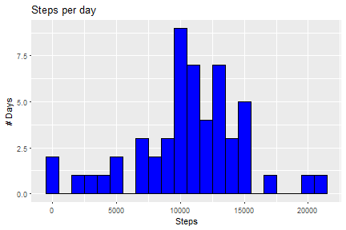
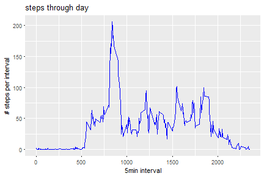
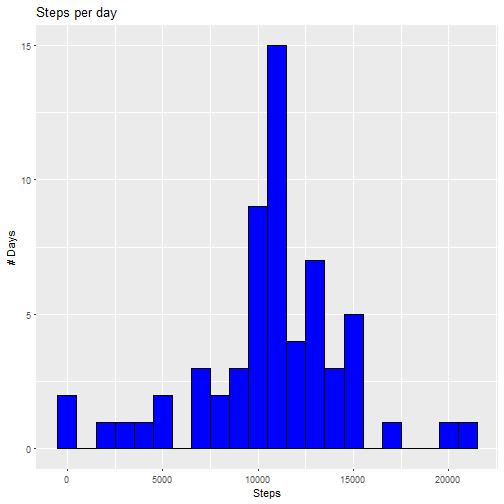
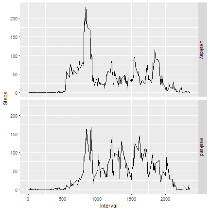
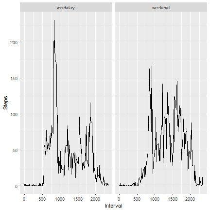

##Loading data


```r
if(!file.exists("repdata_data_activity.zip")) {
  temp <- tempfile()
  download.file("https://d396qusza40orc.cloudfront.net/repdata%2Fdata%2Factivity.zip",temp)
  file <- unzip(temp)
  unlink(temp)
}

DATA<-read.csv("activity.csv")
```

# Question 1
##What is mean total number of steps taken per day?

Data setting

```r
Data_Q1<-na.omit(DATA) 
A1<-setNames(aggregate(Data_Q1[,1],list(Data_Q1$date),sum),c("Day","Steps"))
```
Plotting

```r
library(ggplot2)
g<-ggplot(A1,aes(x=Steps,))
g+geom_histogram(color="black",fill="blue",binwidth = 1000)+labs(title="Steps per day")+ylab("# Days")
```




```r
mean1<-as.integer(mean(A1$Steps))
median1<-median(A1$Steps)
```
Removing the NA's from our data, we have that the mean of the total number of steps taken per day is 10766. The median is equal to 10765.


#Question 2
##What is the average daily activity pattern?
Plotting

```r
A2<-setNames(aggregate(Data_Q1[,1],list(Data_Q1$interval),mean),c("Interval","Steps"))
g2<-ggplot(A2,aes(x=Interval,y=Steps))
g2+geom_line(color="blue")+labs(title="steps through day")+ylab("# steps per interval")+xlab("5min interval")
```



```r
as.integer(A2[which.max(A2$Steps),])
```

```
## [1] 835 206
```
At 13:55 (interval 835) is when are registered the maximal average of steps in a day (206).


#Imputing missing values


```r
sum(is.na(DATA))
```

```
## [1] 2304
```

```r
sum(is.na(DATA$steps))
```

```
## [1] 2304
```

```r
perc_NAs=100*sum(is.na(DATA))/nrow(DATA)
```
There's 2,304 NA's in the Dataset, all of them at "steps" column. These are the 13.1147541% of total observations.

So, the strategy that we will apply in order to replace the NA's in the data set is to filling these with the mean per interval that we have calculated above.


```r
DATA2<-DATA
DATA2$steps<-ifelse(is.na(DATA$steps),A2$Steps[match(DATA$interval,A2$Interval)],DATA$steps)
```

Then we plotf rom our new Dataset, an Histogram with of the total number of steps taken each day .


```r
A3<-setNames(aggregate(DATA2$steps,list(DATA2$date),sum),c("Day","Steps"))
g<-ggplot(A3,aes(x=Steps))
g+geom_histogram(color="black",fill="blue",binwidth = 1000)+labs(title="Steps per day")+ylab("# Days")
```



In order to compare our new results with the obtained in Question number one, we calculate the new mean and median as follows:

```r
mean2<-as.integer(mean(A3$Steps))
median2<-median(A3$Steps)

dif_mean=100*(mean2-mean1)/mean1
dif_median=100*(median2-median1)/median1
```
After filling the NA's in our Dataset, we conclude that the mean of steps per day shows no variation. By the other hand, median shows just 0.0110421% of variation. However, both histograms show us that the frequency of steps per day vary, because we consider more than 2,304 new observations.


#Question 3
##Are there differences in activity patterns between weekdays and weekends?

In order to answer this question, we will create a new factor called "day_type" to indicate whether a day is on weekends or weekdays.  Finally, we prepare a table with the average number of steps taken in every 5 minutes interval and we plot.


```r
DATA2$date<-as.Date(DATA2$date)
DATA2$day<-weekdays(DATA2$date,abbreviate = T)
DATA2$day_type<-ifelse(DATA2$day=="Sat","weekend",ifelse(DATA2$day=="Sun","weekend","weekday"))

library(dplyr)

A4<-setNames(aggregate(DATA2[,1],list(DATA2$interval,DATA2$day_type),mean),c("Interval","Weekday","Steps"))
```

  


```r
library(reshape2)
g3<-ggplot(A4,aes(x=Interval,y=Steps,shape = Weekday ))

g3+geom_line()+facet_grid(facets=Weekday~.)
```



On both, weekdays and weekends, the activity start around interval 540 (5am), but on weekdays increase it much stronger than on weekends. on Saturday or Sundays the 50 steps can be reached after the interval 750. By the other hand, on weekdays this happens just after interval 500. It can be also apreciated that on weekends finish the activity after interval 2,000. by the other hand on weekends, there is almost no activity at interval 2000.  

```r
g3+geom_line()+facet_grid(facets=.~Weekday)
```




On both, weekdays and weekends,the peak of steps occurs around same time (between interval 800 and 900), but it's much higher on weekdays. However, on weekdays the activity reach more than 100 steps just once again, around interval 1850. By the other hand, on weekends at least 7 times the activity is higher than 100 steps.
